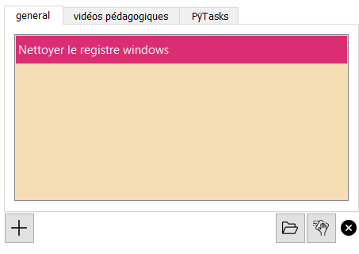

# PyTasks
Petit programme permettant de gérer ses tâches depuis le bureau. Il s'inspire grandement du cours de Thibault Houdon sur la plateforme udemy https://www.udemy.com/course/applications-bureau-qt-python/learn/lecture/16417100 avec de nombreuses fonctionnalités ajoutées.
Codé en python avec PyQt5 et fbs.
Me contacter pour obtenir l'installeur ou l'exécutable.

  
